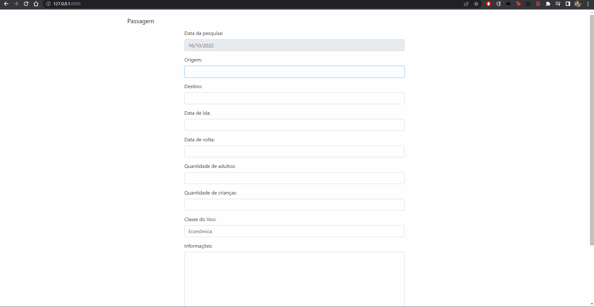

# Aplicação Web Django - Formulário de Passagens

<h1>
    
</h1>

# 📝 Sobre o projeto

Este projeto foi desenvolvido durante o curso de Django da [Alura](https://www.alura.com.br/).

Formulário de Passagens é uma aplicação web que permite consultas de passagens aéreas, e retorna os resultados. Nele há
validações se há dígitos numéricos nos campos `origem` e `destino`, e se a `data de ida` é maior que a `data de volta`,
se os campos `origem` e `destino` são iguais, e se a `data de ida` é menor que a data atual.

# 🛠 Tecnologias Utilizadas

O projeto foi desenvolvido utilizando as seguintes tecnologias:

- [Python](https://www.python.org/)
- [Django](https://www.djangoproject.com/)
- [Bootstrap](https://getbootstrap.com/)
- [SQLite3](https://www.sqlite.org/index.html)
- [HTML](https://developer.mozilla.org/pt-BR/docs/Web/HTML)
- [CSS](https://developer.mozilla.org/pt-BR/docs/Web/CSS)
- [JavaScript](https://developer.mozilla.org/pt-BR/docs/Web/JavaScript)
- [Git](https://git-scm.com/)

# 🚀 Como executar o projeto

1. clonar repositório

```bash
https://github.com/Havokzbr/djang-formulario-passagens.git
```

2. entrar na pasta do projeto

```bash
cd djang-formulario-passagens
```

3. criar ambiente virtual

```bash
python -m venv venv
```

4. ativar ambiente virtual

```bash
venv\Scripts\activate
```

5. instalar dependências

```bash
pip install -r requirements.txt
```

6. executar o projeto

```bash
python manage.py runserver
```
